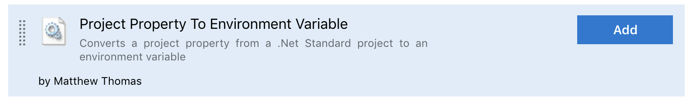
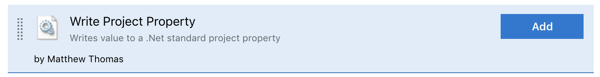

Project property tools consists of two build steps

# Project Property To Environment Variable

## Overview
This task reads your .Net Standard csproj file, and converts the specified project property to an environment variable.

This task includes the option to define a prefix for the variable.

# Write Project Property

## Overview
This task writes a value back to your .Net Standard csproj file - in the specified project property.